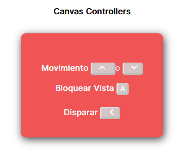
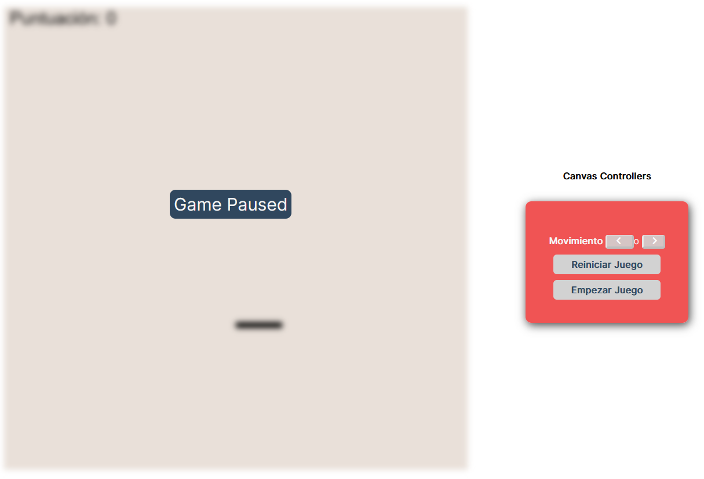
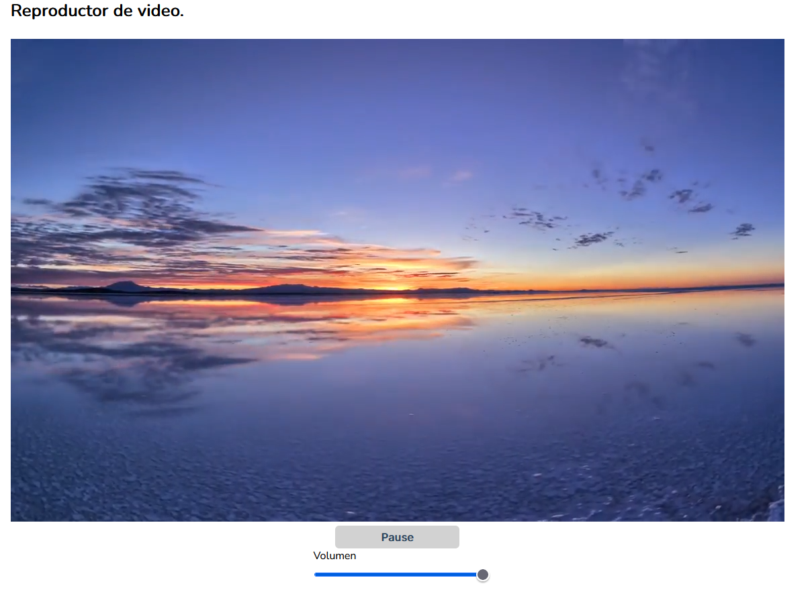
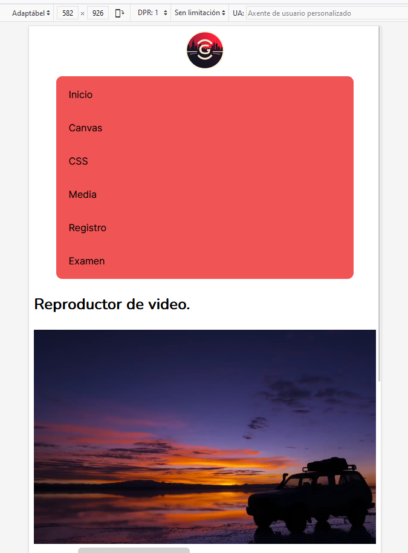
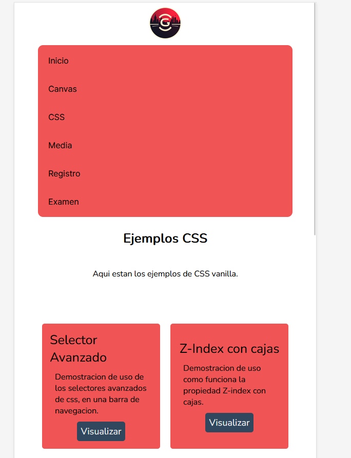

# Canvas y CSS | DIW Yeison Gonzalez Rascado

### Indice

1. [Descripción](#descripción)
2. [Tecnologías](#tecnologias)
    1. [Google Fonts](#google-fonts)
3. [Apartados](#apartados)
    1. [Canvas](#canvas)
    2. [CSS](#css)
    3. [Media](#media)
4. [Templates](#templates)
5. [Diseño Responsive](#diseño-desponsive)


### Descripción 

La web trata de un portal basico donde se muestran varios juegos y ejemplos de CSS, esta orientada a mostrar ejemplos para el aprendizaje.


### Tecnologias

Toda la pagina usa caracteristicas de la programación web vanilla, no se a usado ningun framework css ni js.

- HTML
- CSS
- JavaScript
- Google Fonts
- Git


### Google Fonts

Decidi usar una de las fuentes que nos proporciona Google Fonts. Para implementar la fuente de Google se debe usar la funcion import().

Aqui esta el ejemplo, importo la fuente Nunito **?family=Nunito** con el grosor **wght@400**.

Luego para implementarla la llamo con el font-family. 

```css
@import url('https://fonts.googleapis.com/css2?family=Nunito:wght@400&display=swap');

body {
    font-family: 'Nunito', sans-serif;
}
```


### Canvas

Un gran apartado de la pagina son los juegos hechos con Canvas.

Cada juego tiene su propio script, que aloja toda la funcionalidad del mismo. Luego son cargados mediante una etiqueta canvas.
```html
<canvas id="AlienCanvas" width="800" height="800"></canvas>
```
En la cual definimos: 

- ID: La referencia del canvas para que su archivo js lo pueda cargar
- Width y Height: El alto y ancho del canvas.

Tambien en algunos canvas esta disponible un panel con controles del juego.



Este ejemplo corresponde al juego del Tanque - [tank.js](./assets/canvas/tank.js)

Aqui otro ejemplo donde podemos pausar el juego e incluso llegar a reiniciarlo.



### CSS

Otro de los apartados mas importantes, aqui se muestran ejemplos de ejercicios CSS resueltos de varios ambitos, el codigo de cada ejercicio css esta alojado en un unico archivo css - [exercicies.css](./assets/css/exercicies.css)


### Media

Un Apartado mas pequeño, en el cual hay un reproductor multimedia muy basico, un boton para pausar y renaudar el video junto a un slider para controlar el volumen.




### Templates

Para darle algo de gracia a la pagina decidi que los elementos:
- Header
- Footer
- Navbar

Estuvieran alojados en 3 archivos html distintos y luego cargarlos de manera dinamica en cada pagina de la web con JavaScript.

Para ello uso esta funcion creada por mi.

```js
function loadAssetsElement(htmlAsset, targetElement,className) {
    const xhr = new XMLHttpRequest();
    xhr.open('GET', htmlAsset, true);
    xhr.onreadystatechange = function () {
        if (xhr.readyState === 4 && xhr.status === 200) {
            document.getElementById(targetElement).innerHTML = xhr.responseText;
            document.getElementById(targetElement).classList.add(className);
        }
    };
    xhr.send();
}
```

La cual funciona via XHR, basicamente hace una peticion Http a el html de mi template (header.html, footer.html,navbar.html), carga y vuelca el contienido en el elemento que se pasa por cabecera, tambien se puede agregar una clase para css si fuera necesario.


### Diseño Responsive

Otra de las cosas importantes de la pagina es que tenga buena adaptabilidad a dispositivos varios, como moviles , tables, televisores, ordenadores etc..
En eso se basa el diseño responsive, deja aqui un par de ejemplos sobre como arregle los diseño.

Ejemplo en Media



```css
@media (max-width: 830px) {
    .nav {
        justify-content: center;
        flex-direction: column;
        gap: 10px;
    }

    .nav-bar {
        flex-direction: column;
        align-items: stretch;
        width: 85%;
        margin-top: 1px;
        gap: 5px;
    }

    .nav-bar a {
        width: 100%;
        box-sizing: border-box;
    }
}
```

Ejemplo en CSS, en un grid



Basicamente lo que hago es que cuando llegue a **750px** que se ponga el grid con 2 columnas y cuando llegue a **490px** que se ponga solo en una columna.

```css
@media (max-width: 750px) {
    .grid-container {
        grid-template-columns: repeat(2, 2fr);
    }
}

@media (max-width: 490px) {
    .grid-container {
        grid-template-columns: repeat(1,1fr);
    }
}
```